# Donation Catalog ERD

## 範圍

這份 ERD 只對齊目前 `fig.pen` 已經定義的畫面，不預留規格外欄位。

目前已明確存在的畫面：

- 公益團體列表
- 搜尋中
- 搜尋無結果
- 所有類別 modal
- 捐款專案列表卡
- 義賣商品列表卡

目前**不處理**的範圍：

- 點擊卡片後的 detail page

## 畫面需要的資料

### 公益團體卡

- 團體名稱
- 團體簡介
- 團體 logo

### 捐款專案卡

- 專案標題
- 所屬團體名稱
- 專案封面圖
- 類別 tags

### 義賣商品卡

- 商品名稱
- 所屬團體名稱
- 商品封面圖
- 價格

### 類別 modal / 篩選

- 類別名稱
- 類別排序

## Mermaid ERD

```mermaid
erDiagram
  ASSETS {
    uuid id PK
    varchar url
    varchar alt_text
    timestamptz created_at
  }

  CATEGORIES {
    uuid id PK
    varchar name
    int sort_order
    timestamptz created_at
    timestamptz updated_at
  }

  ORGANIZATIONS {
    uuid id PK
    varchar name
    varchar summary
    uuid logo_asset_id FK
    timestamptz created_at
    timestamptz updated_at
  }

  DONATION_PROJECTS {
    uuid id PK
    uuid organization_id FK
    varchar title
    uuid cover_asset_id FK
    timestamptz created_at
    timestamptz updated_at
  }

  SALE_PRODUCTS {
    uuid id PK
    uuid organization_id FK
    varchar title
    numeric price_amount
    uuid cover_asset_id FK
    timestamptz created_at
    timestamptz updated_at
  }

  ORGANIZATION_CATEGORIES {
    uuid organization_id PK, FK
    uuid category_id PK, FK
    timestamptz created_at
  }

  PROJECT_CATEGORIES {
    uuid donation_project_id PK, FK
    uuid category_id PK, FK
    timestamptz created_at
  }

  PRODUCT_CATEGORIES {
    uuid sale_product_id PK, FK
    uuid category_id PK, FK
    timestamptz created_at
  }
```

